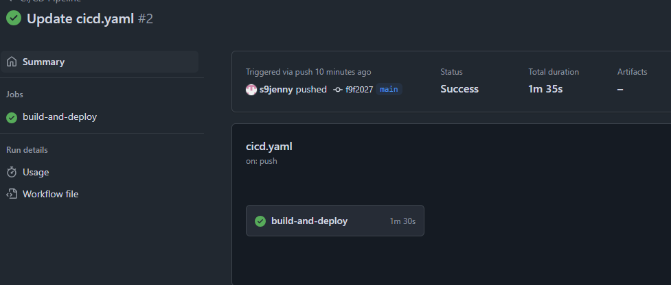
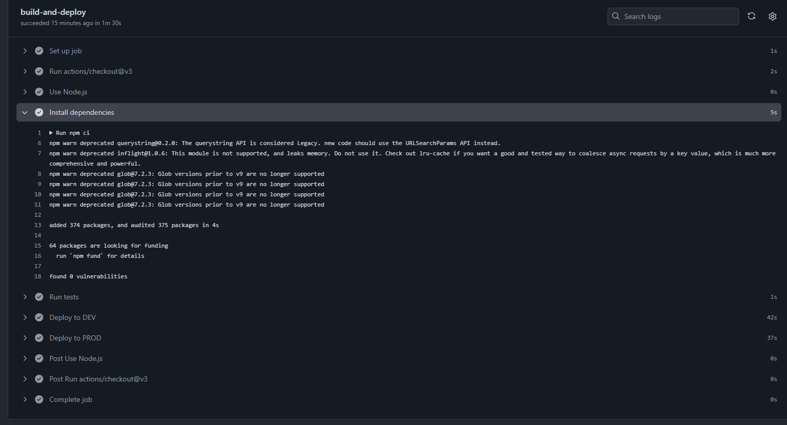
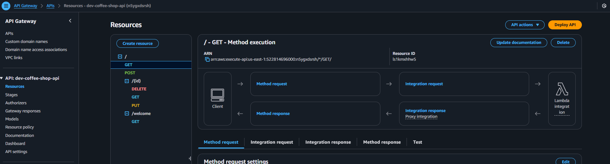
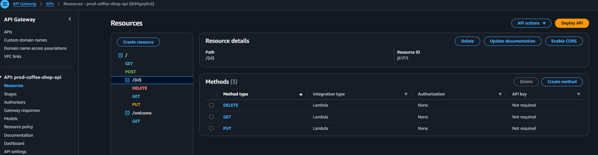
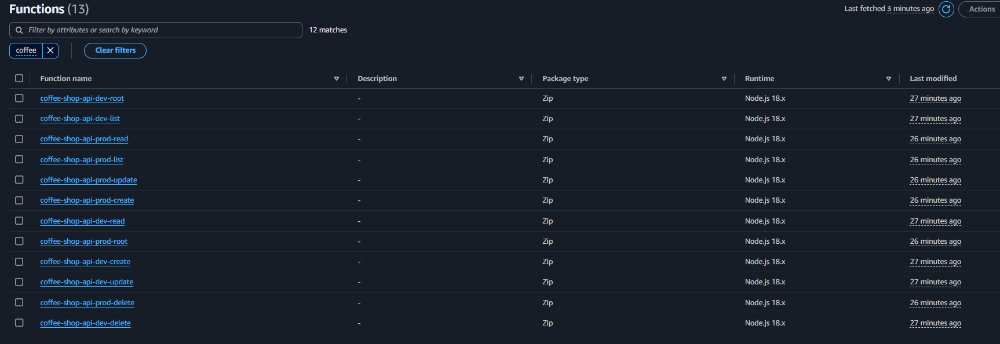
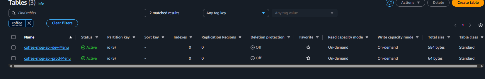
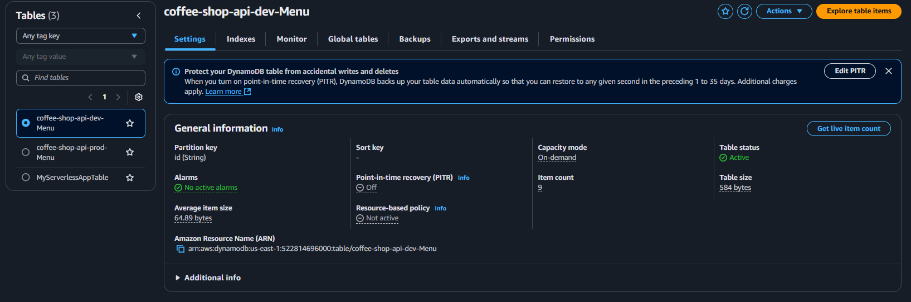
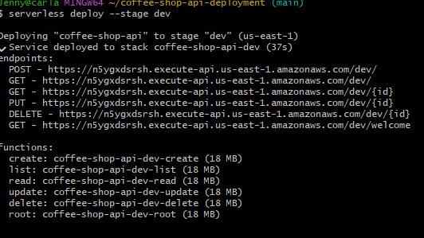
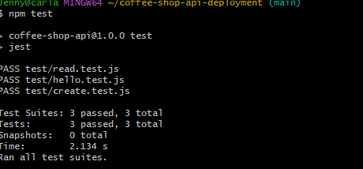
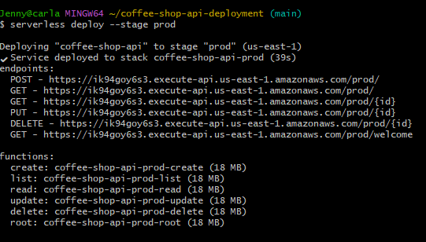

# CoffeeShop REST API — Serverless CRUD App (AWS + GitHub Actions)

A fully serverless CRUD REST API for managing a Coffee Shop menu. Built using the Serverless Framework, AWS Lambda, API Gateway, and DynamoDB with automated deployments via GitHub Actions.

---

## 🚀 Features

- Create, Read, Update, Delete menu items
- RESTful endpoints (GET, POST, PUT, DELETE)
- AWS DynamoDB as the persistent data store
- Lambda handlers organized per CRUD action
- CI/CD pipeline using GitHub Actions with multi-stage deployment (`dev`, `prod`)
- Infrastructure as Code with `serverless.yml`
- Minimal unit tests with placeholders

---

## 🛠️ Tech Stack

- **Language**: Node.js (JavaScript)
- **Framework**: Serverless Framework
- **Cloud Provider**: AWS (Lambda, API Gateway, DynamoDB)
- **CI/CD**: GitHub Actions

---

## 📁 Project Structure

```
coffee-shop-api/
├── .github/
│   └── workflows/
│       └── cicd.yaml         # CI/CD pipeline config
├── handlers/                 # Lambda functions
│   ├── create.js
│   ├── delete.js
│   ├── list.js
│   ├── read.js
│   ├── update.js
│   └── root.js
├── lib/
│   └── dynamo.js             # DynamoDB DocumentClient setup
├── scripts/
│   └── warmup.sh             # Optional lambda warmup script
├── tests/
│   ├── create.test.js
│   └── read.test.js
├── .gitignore
├── package.json
├── package-lock.json
├── serverless.yml
└── README.md
```

---

## 📦 Setup Instructions

1. **Clone the repo**
   ```bash
   git clone https://github.com/s9jenny/coffee-shop-api.git
   cd coffee-shop-api
   ```

2. **Install dependencies**
   ```bash
   npm install
   ```

3. **Deploy to AWS**
   ```bash
   serverless deploy --stage dev
   # or for production
   serverless deploy --stage prod
   ```

---

## 🌐 API Endpoints

| METHOD | PATH             | FUNCTION        | DESCRIPTION             |
|--------|------------------|-----------------|-------------------------|
| GET    | `/welcome`       | `root.handler`  | Health check route      |
| POST   | `/`              | `create.handler`| Add a menu item         |
| GET    | `/`              | `list.handler`  | List all menu items     |
| GET    | `/<built-in function id>`          | `read.handler`  | Read item by ID         |
| PUT    | `/<built-in function id>`          | `update.handler`| Update item by ID       |
| DELETE | `/<built-in function id>`          | `delete.handler`| Delete item by ID       |

---

## 🧪 Running Tests

```bash
npm test
```

---

## 📸 Screenshots for Submission

Below are the required screenshots showing deployment, CI/CD logs, AWS resource creation, and test output.


### Screenshot 1


### Screenshot 2


### Screenshot 3


### Screenshot 4


### Screenshot 5


### Screenshot 6


### Screenshot 7


### Screenshot 8


### Screenshot 9


### Screenshot 10



## 🎥 Loom Video Walkthrough

Here is a recorded walkthrough of the project, explaining the code structure, CI/CD setup, Serverless deployment, and AWS services used:

[Watch the video](https://www.loom.com/share/c7313fa242dd4e5bb2af0889b4d54185?sid=3253226c-4a7c-444f-905c-b282a57bdab0)


---

> 👩🏾‍💻 Author: Jennifer Carla · GitHub: [@s9jenny](https://github.com/s9jenny)

---

## 📄 License

This project is licensed under the MIT License 
